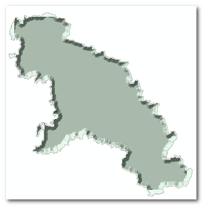
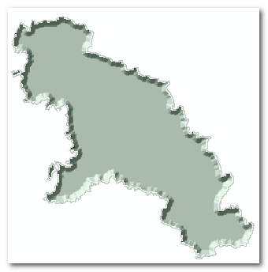

# 更新日志2021年7月

## 2021/6/4

1. 修复**均匀渐变_黑色**的错误。
2. 修复了由于 ArcGIS 10.2 版本的 arcpy.Buffer_analysis 方法只接受7个参数所导致的错误。

## 2021/6/30

1. 更新了**浮雕工具**的说明，提供了负缓冲距离参考。

2. 更新了**普通样式工具箱**->**缓冲区轮廓**，添加了**放大倍数**这个参数，用户可通过输入方法倍数（整数）来放大缓冲区。

   比如：默认缓冲区是 30 60 90 米，输入10，可获得 300 600 900 米的缓冲区。

## 2021/7/6

1. 更新了**浮雕工具**，现在可以自动设置处理范围和输出的栅格腌膜范围。（另外注意使用这个工具需要开启 SpatialAnalyst 扩展模块）

原先的效果

现在的效果

## 2021/9/2

**均匀渐变_黑色** 工具改名为 渐变轮廓 黑；

**内部渐变_偏移效果** 工具改名为 复合 渐变偏移；

工具重新编排，按使用类别进行分类。

